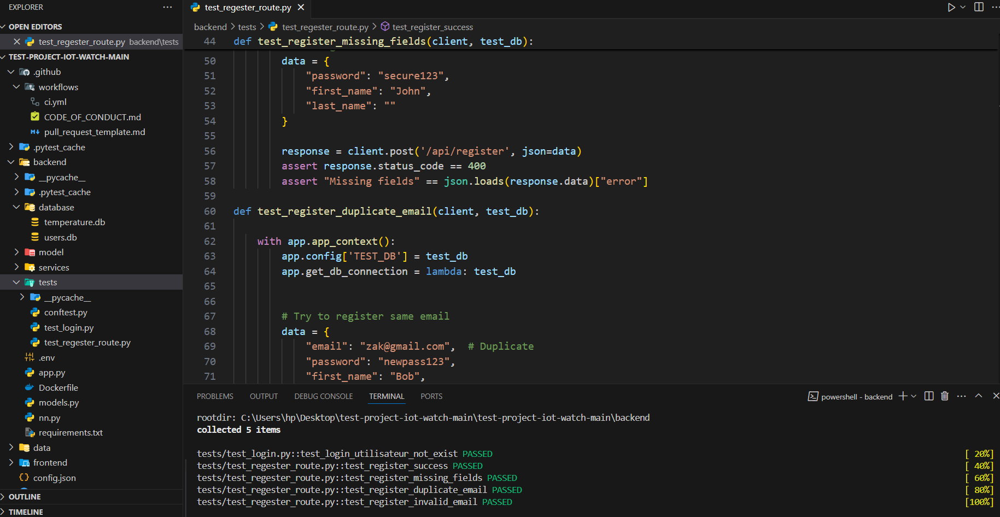
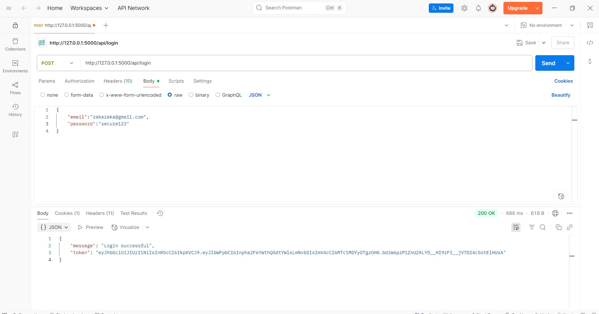
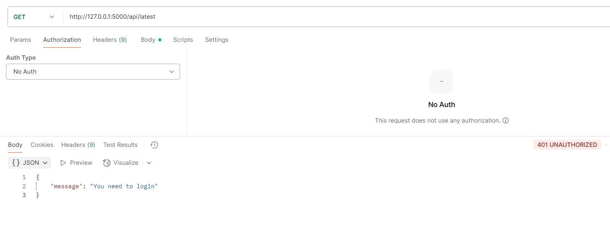

## Description

Please include a summary of the change and which issue is fixed. Also include relevant motivation and context.

- Ajout d'un système d'authentification avec email/mot de passe.  
- Sécurisation des routes via JWT.  
- Connexion/Inscription avec vérification des champs. 

Fixes # (Authentification Setup)

## Type of change

- [ ] Bug fix
- [X] New feature
- [ ] Breaking change
- [ ] Documentation update
- [ ] Code style update (formatting)

## Checklist

- [X] My code follows the style guidelines of this project
- [X] I have performed a self-review of my code
- [X] I have commented my code, particularly in hard-to-understand areas
- [X] I have added tests that prove my fix is effective or my feature works
- [X] New and existing unit tests pass locally
- [ ] I have updated the documentation if necessary

## Additional context

Add any other context or screenshots here.

